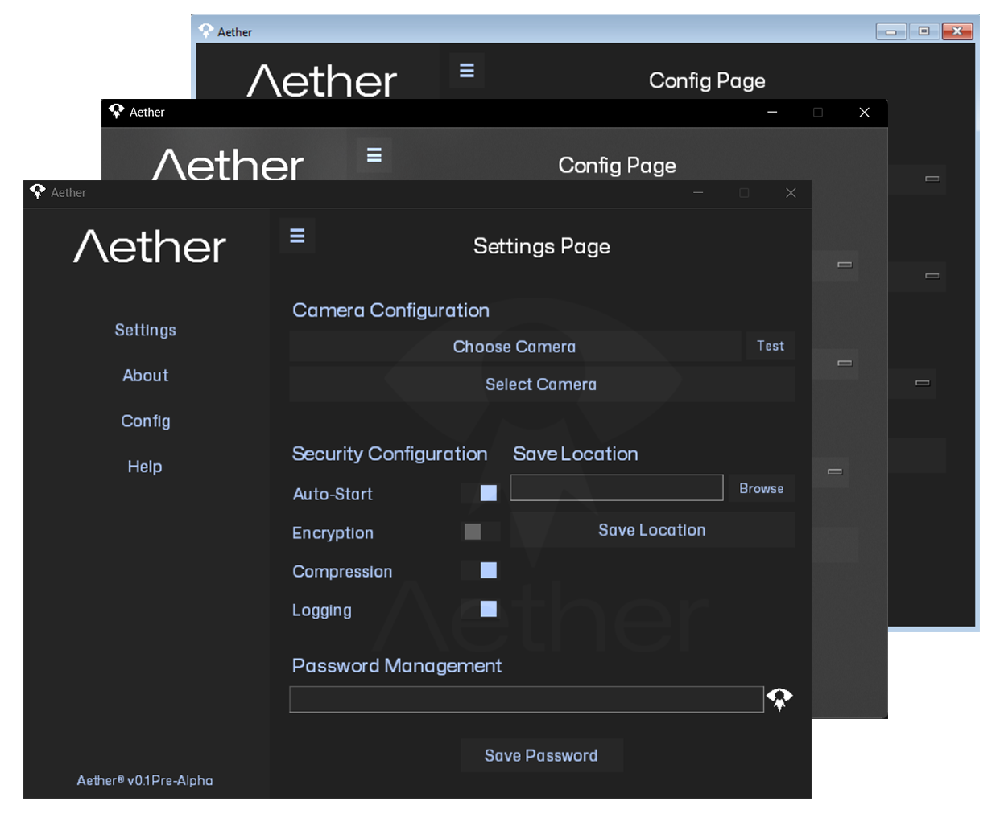

  

> **Note**: Aether is currently in the pre-release development phase.

# Aether: Your Digital Webcam Sentinel

Aether is an open-source application designed to enhance privacy by automatically capturing and securely storing webcam activity during system access. It operates entirely offline to ensure your data remains private. Whether for personal or professional use, Aether provides detailed activity tracking with user-friendly customization options.

## ✨ Features

  

    <ul>
      <li><strong>Auto Capture</strong>: Saves photos during login to your local device</li>
      <li><strong>Encryption</strong>: Secures all captured images</li>
      <li><strong>Offline Only</strong>: Operates without external servers</li>
      <li><strong>Activity Tracking</strong>: Records all capture events</li>
      <li><strong>Customization</strong>: Flexible privacy and security settings</li>
      <li><strong>Local Storage</strong>: Full control of your data</li>
      <li><strong>Performance</strong>: Minimal system resource usage</li>
      <li><strong>Simple UI</strong>: Easy setup and operation</li>
    </ul>
  

  

    
  

## 📋 Requirements
- Windows 10/11 (64-bit)
- Webcam or compatible camera device
- 50MB free disk space
- Administrator privileges for installation

## 🚀 Getting Started ([Install Tutorial](https://www.youtube.com/watch?v=F2RvnRn0ZeM))
1. Download Aether from the [Aether Website](https://enesehs.me/Aether)
2. Run `AetherSetup.exe` to install
3. Launch `Aether.exe` with Administrator privileges and complete the setup wizard

## ⚙️ Configuration Guide

### 📷 Camera Settings
- Choose your preferred camera device
- Test and calibrate the camera
- Set image quality and capture timing

### 💾 Storage Options
- Default save path: `User/Pictures/Aether`
- Customize the storage location if desired
- Set preferences for secure storage and backups

### 🔐 Security Configuration
- Enable automatic startup on login
- Protect your data with a password
- Adjust compression settings for images
- Enable detailed activity logging
- Configure access control for enhanced security

### 🔑 Password Notes
- The default password is `1` Update it for better security
- Avoid using non-ASCII characters in passwords (e.g., ü, é, ö, ø, â etc.)
- If changing passwords, delete old encrypted files beforehand
- Use unique passwords for different files to enhance protection

### 🛠️ Advanced Features
- Integration with Task Scheduler for custom automation
- Event-based triggers for capturing
- Debug logging for troubleshooting

## ⚠️ Known Issues
- Some issues with the "encryption-only" mode
- Splash screen delays during camera detection
- Administrator privileges required for auto-run
- Compatibility limitations with older hardware

## 🚧 Planned Features
- [ ] Multi-user support  
- [ ] Dark mode for the UI  
- [ ] Cloud backups
- [ ] Linux & macOS compatibility  
- [ ] More customization for event-based triggers 

## 📊 Performance Benchmarks

| Scenario   | CPU Usage | RAM Usage | Time              |
|------------|-----------|-----------|-------------------|
| Idle       |   0%      | ~0MB      | 0s                |
| Capturing  | 3-5%      | ~30MB     | 1.54s             |
| Encrypting | 5-8%      | ~40MB     | 0.96s             |
| **Total Process** |  |  | 2.5-4s (avg) |

> **Note**: Performance may vary by system. High-end devices typically complete the entire process in ~2.5 seconds.

## 🤝 Support and Community

We're here to help and connect with you:

- **Contact Us**: [enesehs](https://enesehs.me)
- **Report Issues**: [GitHub Issues](https://github.com/enesehs/aether/issues)
- **Support Our Work**: [Buy me a coffee](https://buymeacoffee.com/enesehs)
- **Connect with Us**: [LinkedIn Profile](https://www.linkedin.com/in/enesehs/)

Join our community and stay updated with the latest news and updates!
## 📄 License
Aether is licensed under the [GNU General Public License v3.0](LICENSE).

## 👥 Contributing
We welcome contributions! Check out our [Contributing Guidelines](CONTRIBUTING.md) to get started.
